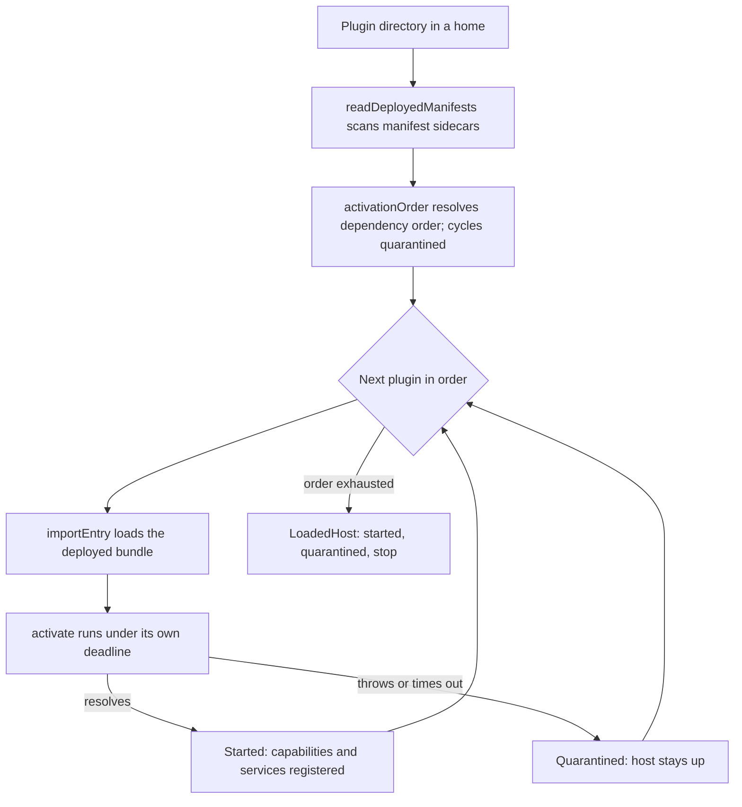

`{{ package_name }}` scans a home's deployed plugin manifests, resolves a safe activation order from
their declared dependencies, and imports and activates each plugin's entry module in turn under
its own deadline. A plugin that throws, times out, or exports nothing usable is quarantined
without taking the rest of the host down.

## Under-the-Hood Architecture



## Structure

- `src/plugin-manifests.ts` - `readDeployedManifests` scans a home's plugin directory for
  manifest sidecars, validating each and pairing it with its deployed bundle path
- `src/plugin-host.ts` - `startPlugins` resolves activation order, imports and activates each
  plugin under a timeout, and returns a `LoadedHost`; `callCapability` bounds a single capability
  call with a deadline; `ledgerRows` renders the host's ledger for a surface to display
- `src/index.ts` - the barrel: `startPlugins`, `callCapability`, `ledgerRows`,
  `readDeployedManifests`, the four timeout constants, and their types
- `dist/` - compiled output (generated; never committed)

## Installation

As a submodule, for an app or library built in this ecosystem:

```bash
git submodule add https://github.com/intisy-ai/plugin-host plugin-host
```

Or as an npm dependency:

```bash
npm install {{ package_name }}
```

## Configuration

`{{ package_name }}` reads no configuration file of its own. `PluginHostOptions.runtimeFor` builds the
`PluginRuntime` each plugin's context receives, and whoever starts the host supplies that
function, so the host's config lives wherever that runtime is built, not here.

## Logging

`{{ package_name }}` writes no log file of its own. The `PluginRuntime` a plugin receives carries its
logger, and that runtime is built by whoever starts the host, so the host's logging lives
wherever that runtime is built, not here.
